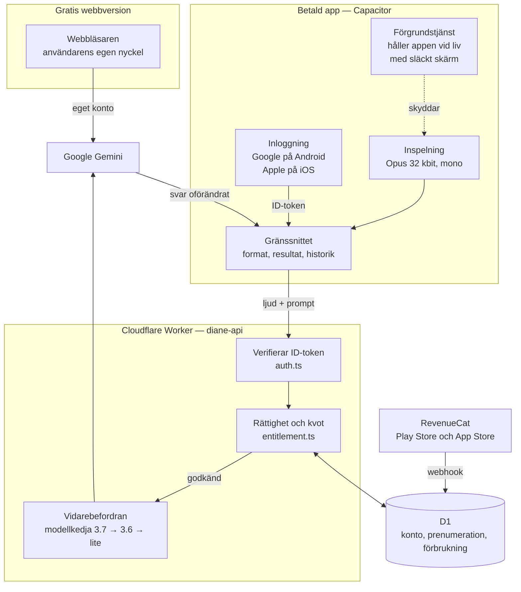
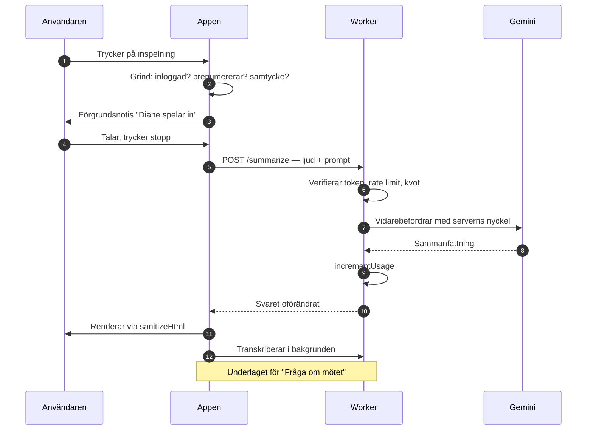

# Arkitektur

## Systemöversikt

Diane finns i två skepnader som delar samma kodfil. Webbversionen använder
besökarens egen Gemini-nyckel. Appen håller nyckeln på servern, bakom
inloggning och prenumeration. Skillnaden avgörs i runtime — se
[decisions/0002-en-kodbas-tva-lagen.md](decisions/0002-en-kodbas-tva-lagen.md).

Observera pilen märkt **"svar oförändrat"**: proxyn returnerar Geminis svar
rått. Det är det som gör en gemensam kodbas möjlig — svarsparsningen blir
identisk i båda lägena. Se avsnittet nedan.

## Förloppet vid en inspelning

Motsvarande funktioner i `index.html`:

| Steg | Funktion |
|---|---|
| Grinden | `startRecording()` — nyckel i webbläge, konto och samtycke i appläge |
| Inspelning | `MediaRecorder`, plus Wake Lock och keep-alive-oscillatorn (kritisk på iOS) |
| Avslut | `onStop` → `blobToBase64()` → `process()` |
| Anropet | `callModel()` för sammanfattningen, `callGeminiRaw()` för övriga |
| Rendering | `TITLE:`-raden plockas ut, resten saneras via `sanitizeHtml()` |
| Sparande | `saveToHistory()` — `localStorage`, nyckeln `vs_history` |

## Varför proxyn returnerar Gemini rått

`backend/src/index.ts` skickar tillbaka Geminis svarskropp oförändrad.
Det är ett medvetet val: klientens svarsparsning blir **identisk** i båda
lägena, vilket är det som gör en gemensam kodbas praktiskt möjlig.
Bryt inte detta — inför man ett eget svarsformat i proxyn måste klienten
plötsligt hantera två format.

## Vad som är gemensamt kontra lägesspecifikt

Ungefär 85 % av klientkoden är lägesoberoende: inspelning, format-
prompter, sanering, historik, delning, redigering, Q&A.

Lägesspecifikt är i praktiken bara fyra ställen:

| Ställe | Webb | App |
|---|---|---|
| anropet i `generate()` | Gemini direkt | `POST /summarize` |
| gate i `startRecording()` | API-nyckel finns? | inloggad + prenumererar? |
| inställningspanelen | nyckel, modell | konto, prenumeration |
| skärmlistan | `setup` | `signin`, `paywall` |

Håll den listan kort. Växer den är det ett tecken på att något byggs i fel lager.

## Säkerhetsgränser

- **All AI-genererad HTML måste gå genom `sanitizeHtml()`** före insättning.
  Vitlista: `article, section, h2, p, ul, ol, li, strong, em, br`. Alla
  attribut strippas. Sätt aldrig `innerHTML` på rått Gemini-svar.
- I appläget ser klienten **aldrig** vår Gemini-nyckel — den finns bara som
  Worker-secret.
- ID-token skickas som `Authorization: Bearer`, verifieras mot leverantörens
  JWKS i `backend/src/auth.ts`.
